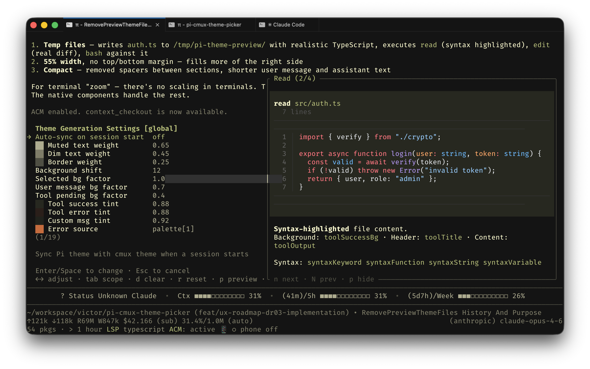

# pi-cmux-theme-picker

Live [cmux](https://cmux.dev) terminal theme picker for [Pi](https://pi.dev). Synchronises Pi and cmux themes with debounced preview and configurable theme generation.



## What it does

- **`/theme`** — opens an inline picker to browse, filter, search, and live-preview all bundled cmux (Ghostty) themes. Confirm with Enter, cancel with Esc.
- **`/theme "Theme Name"`** — apply a named theme directly without opening the picker.
- **`/theme-settings`** — configure auto-sync, theme generation parameters, and preview timing.
- **Auto-sync** (opt-in) — reads the active cmux theme and generates a matching Pi theme on session start.

## Install

```
pi install pi-cmux-theme-picker
```

## Usage

```
/theme              # Open the picker
/theme Catppuccin   # Apply a theme directly by name
/theme-settings     # Configure theme generation and settings
```

### Picker controls

| Key | Action |
|:---|:---|
| `Up` / `Down` | Navigate themes with live preview |
| `Enter` | Apply selected theme |
| `Esc` | Cancel and restore original |
| `Tab` | Cycle filter: all / dark / light |
| Type | Incremental search |
| `Backspace` | Delete search character |

### Settings (`/theme-settings`)

| Setting | Default | Description |
|:---|:---|:---|
| Auto-sync on session start | off | Sync Pi theme from current cmux theme when a session starts |
| Preview debounce (ms) | 200 | Cooldown before theme preview applies (50–1000ms) |

#### Theme generation parameters

Fine-tune how cmux palette colors map to Pi theme roles:

| Parameter | Default | Description |
|:---|:---|:---|
| Muted text weight | 0.35 | fg/bg mix for muted text (higher = more fg) |
| Dim text weight | 0.20 | fg/bg mix for dim text |
| Border weight | 0.15 | fg/bg mix for muted borders |
| Background shift | 8 | Brightness offset for derived backgrounds |
| Selected bg factor | 0.5 | Multiplier of bgShift for selected item bg |
| User message bg factor | 0.3 | Multiplier of bgShift for user message bg |
| Tool pending bg factor | 0.2 | Multiplier of bgShift for tool pending bg |
| Tool success tint | 0.92 | bg/success blend (higher = subtler) |
| Tool error tint | 0.92 | bg/error blend |
| Custom msg tint | 0.88 | bg/accent blend for custom messages |
| Error fallback | `#cc4444` | Fallback when palette hue is too far from red |
| Success fallback | `#44aa44` | Fallback when palette hue is too far from green |
| Warning fallback | `#ccaa33` | Fallback when palette hue is too far from yellow |
| Link fallback | `#5599dd` | Fallback when palette hue is too far from blue |
| Accent fallback | `#cc66cc` | Used when palette[5] is missing |
| Accent alt fallback | `#66cccc` | Used when palette[6] is missing |
| Link contrast minimum | 4.5 | Minimum contrast ratio for readable links (WCAG AA) |

All parameters update live in the settings panel. Changes are saved to disk and persist across sessions.

## Configuration

Settings are stored as JSON:

- **Global:** `~/.pi/agent/extensions/pi-cmux-theme-picker.json`
- **Project override:** `<cwd>/.pi/extensions/pi-cmux-theme-picker.json`

Settings are reloaded automatically on session start, `/reload`, resume, and fork.

## How it works

1. Reads cmux bundled Ghostty theme files from `/Applications/cmux.app/Contents/Resources/ghostty/themes/`.
2. Converts the palette into a full Pi theme JSON using configurable ThemeParams (semantic colors, contrast-aware link picking, dark/light adaptation).
3. Preview uses trailing-only debounce — cursor movement is instant, theme applies after configurable cooldown. In-memory Theme instances bypass Pi's theme cache.
4. On confirm, writes a permanent `cmux-sync-{slug}.json` theme file and cleans up old sync artifacts.

## Requirements

- [cmux](https://cmux.dev) installed at `/Applications/cmux.app`
- Pi with `@mariozechner/pi-coding-agent` and `@mariozechner/pi-tui`

## License

MIT
